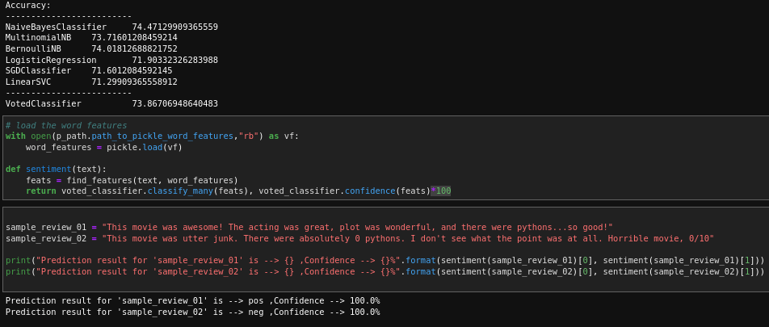
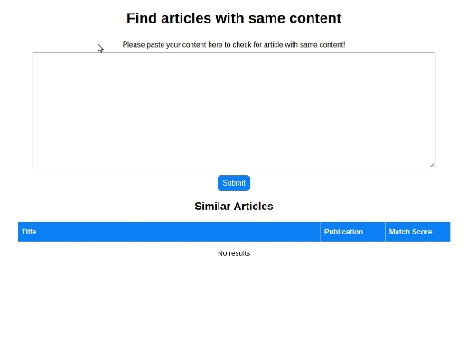

# 66daysofdata_NLP

Journey of 66DaysofData in Natural Language Processing

Please refer to [Ken Jee's #66DaysOfData Challenge](https://www.kennethjee.com/66daysofdata) for more info!

    
## Books

 - [Transformers for Natural Language Processing](https://www.packtpub.com/product/transformers-for-natural-language-processing/9781800565791)
 - [Practical Natural Language Processing](https://www.oreilly.com/library/view/practical-natural-language/9781492054047/)

## Sites

 - [pythonprogramming.net](https://pythonprogramming.net/tokenizing-words-sentences-nltk-tutorial/)
 
## Day 1 of #66DaysOfData

How we can scrap data from webpages using the Beautiful Soup.

  [Day 01 of #66DaysOfData](day01)
#### Lessons Learned

- reading a html page (Stack Overflow) and parsing and storing it in __Beautiful Soup__ format
- find the nevessary tags and class which it belongs to "question" and "andsers"
- extracting a question and its best-answer pair from a Stack Overflow web page
#### Screenshots

## Day 2 of #66DaysOfData

Getting started with `NLTK`.

  [Day 02 of #66DaysOfData](day02)
#### Lessons Learned

- **Tokenizing** Words and Sentences with NLTK
- Removing **Stop words** with NLTK
- **Stemming** words with NLTK
- **Lemmatization** words with NLTK

#### Screenshots

  
## Day 3 of #66DaysOfData

`NLTK`: part 2.

  [Day 03 of #66DaysOfData](day03)
#### Lessons Learned

- **Part of Speech Tagging** with NLTK
- **Chunking** and **Chinking** with NLTK

#### Screenshots

## Day 4 of #66DaysOfData

`NLTK`: part 3.

  [Day 04 of #66DaysOfData](day04)
#### Lessons Learned

- **Named Entity Recognition** with NLTK
- **Text Classification** 
- Converting **words to Features** 
- `Naive Bayes Classifier` with NLTK

#### Screenshots

## Day 5 of #66DaysOfData

`NLTK`: part 4.

  [Day 05 of #66DaysOfData](day05)
#### Lessons Learned

- Classifying movie_reviews with Scikit-Learn Sklearn and NLTK
- get model accuracy with **cross validation**

#### Screenshots

## Day 6 of #66DaysOfData

`NLTK`: part 5.

  [Day 06 of #66DaysOfData](day06)
#### Lessons Learned

- **Combining Algorithms (classifiers)** with NLTK
- Sklearn + NLTK VoteClassifier

#### Screenshots

## Day 7 of #66DaysOfData

`NLTK`: part 6.

  [Day 07 of #66DaysOfData](day07)
#### Lessons Learned

- saving and loading 'document' and 'word features'
- New movie review data was used and processed

#### Screenshots

## Day 8 of #66DaysOfData

`NLTK`: part 7.

  [Day 08 of #66DaysOfData](day08)
#### Lessons Learned

- NER with NLTK `Stanford NER tagger`.
- Testing NLTK and Stanford NER Taggers for Accuracy

#### Screenshots

[dataset](https://github.com/PinkyBlond/R-Machine-Learning/raw/master/News_Final.csv)
[word2vec-to-analyze-news-headlines](https://towardsdatascience.com/using-word2vec-to-analyze-news-headlines-and-predict-article-success-cdeda5f14751)

## Day 9 of #66DaysOfData

`word2vec`

  [Day 09 of #66DaysOfData](day09)
#### Lessons Learned

- word2vec with gensim
- kaggle data set

#### Screenshots

[Kaggle Data set: Car Features and MSRP](https://www.kaggle.com/CooperUnion/cardataset) 

## Days 10-11 of #66DaysOfData

`LSTM Classification model with Word2Vec`  

  [Days 10-11 of #66DaysOfData](day10-11)
#### Lessons Learned

- working with kaggle data set
- word2vec
- tensorflow LSTM model
- tensorflow embeding layer

#### Screenshots

## Days 12-13 of #66DaysOfData

`TF-IDF`  

  [Days 12-13 of #66DaysOfData](day12-13)
#### Lessons Learned

- Setting up TF-IDF with Scikit Learn
- clustering 22,000 descriptions into 5 categories
- k-means clustering

#### Screenshots

## Day 14 of #66DaysOfData

`Topic Modeling Task`  

  [Day 14 of #66DaysOfData](day14-19)
#### Lessons Learned

- [Kaggle steam-reviews-dataset](https://www.kaggle.com/luthfim/steam-reviews-dataset)
- Preparing the dictionary for typo correction purpose
- `Exploratory data analysis (EDA)`

#### Screenshots

## Day 15 of #66DaysOfData

`Topic Modeling Task`  

  [Day 15 of #66DaysOfData](day14-19)
#### Lessons Learned

- turn `tokenized` documents into a `id <-> term dictionary`
- TF-IDF topic modeling

#### Screenshots

## Day 16 of #66DaysOfData

`LDA (Latent Dirichlet Allocation)`  

  [Day 16 of #66DaysOfData](day14-19)
#### Lessons Learned

- Topic Coherence score
- `LDA (Latent Dirichlet Allocation)`  
- pyLDAvis --> LDA visualizatiom modul

#### Screenshots

<a href="https://www.youtube.com/watch?v=T05t-SqKArY">img ref1</a>
<a href="https://www.kdnuggets.com/2019/09/overview-topics-extraction-python-latent-dirichlet-allocation.html">ref2</a>

## Day 17 of #66DaysOfData

`BERT sentence embedding`  

  [Day 17 of #66DaysOfData](day14-19)
#### Lessons Learned

- Bert: encode sentences --> vectors
- Clustering Silhouette score

#### Screenshots

## Day 18 of #66DaysOfData

`LDA (Latent Dirichlet Allocation)`  

  [Day 18 of #66DaysOfData](day14-19)
#### Lessons Learned

- BERT + LDA 
- `Combining LDA_vector and BERT_Vector` 
- convert corpus --> vector    (using LDA_Model)

#### Screenshots

## Day 19 of #66DaysOfData

`BERT + LDA + Auto-encoder`  

  [Day 19 of #66DaysOfData](day14-19)
#### Lessons Learned

- Auto-Encoder as a dimension reduction technique

#### Screenshots

    
<a href="https://miro.medium.com/max/2000/1*OKCYnB-JbGq1NDwNSKd5Zw.png">img ref</a>

| | TFIDF  | Bert | LDA-Bert  | Bert-LDA-AutoEencoder |
|:---------------:|:---------------:|:---------------:|:---------------:|:---------------:|
| |  |   |  |  |
|__Model Coherence score__ |   0.537|  0.505|   0.553|   0.553|
|__silhouette_score__      | 0.065  | 0.059  | 0.081 | 0.139 |

## Day 20 of #66DaysOfData

`Title Generation`  

  [Day 20 of #66DaysOfData](day20)
#### Lessons Learned

- Kaggle dataset: [Trending YouTube Video Statistics](https://www.kaggle.com/datasnaek/youtube-new) 
- `Generating sequences using Tokenizer API 
- LSTM Model for Title Generation

#### Screenshots

## Day 21 of #66DaysOfData

`Plagiarism-Detection` part_1 

    
     

  [Day 21 of #66DaysOfData](day21-26)
#### Lessons Learned

- Dataset: [A Corpus of Plagiarised Short Answers](https://ir.shef.ac.uk/cloughie/resources/plagiarism_corpus.html) 
- `N-gram Language Model`
- Heatmap Plagiarism visualization

#### Screenshots

## Day 22 of #66DaysOfData

`Plagiarism-Detection` part_2

`Containment score`: the n-gram similarity score

    
     

  [Day 22 of #66DaysOfData](day21-26)
#### Lessons Learned

- `Containment score` a plagiarism similarity measurement
- 'CountVectorizer': Convert a collection of text documents to a matrix of token counts

#### Screenshots

_**Note:** `heavy answers` are based on the source text, but heavily rephrased (and will likely be the most challenging kind of plagiarism to detect)._

## Day 23 of #66DaysOfData

`Plagiarism-Detection` part_3 

`Longest Common Subsequence`: a text similarity score

  
    

_**image note**: `LCS` is 20 characters long.
`Norm LCS` is 20 divided by length of the student answer (27) =>  20/27, or 0.7408_

  [Day 23 of #66DaysOfData](day21-26)
#### Lessons Learned

- `Longest Common Subsequence` a plagiarism similarity measurement

#### Screenshots

## Day 24 of #66DaysOfData

`Plagiarism-Detection` part_4 

`Feature selection`
  

  [Day 24 of #66DaysOfData](day21-26)
#### Lessons Learned

- `Feature selectione` based on correlation matrix

#### Screenshots

## Day 25 of #66DaysOfData

`Plagiarism-Detection` part_5 

`Binary Classification`
  

  [Day 25 of #66DaysOfData](day21-26)
#### Lessons Learned

- `Training sklearn` multiple Classifiers

#### Screenshots

## Day 26 of #66DaysOfData

`Plagiarism-Detection` part_6 

`Multi-class Classification`
  

  [Day 26 of #66DaysOfData](day21-26)
#### Lessons Learned

- Training sklearn multiple multi-class Classifiers
- plotting `decision boundary` with the aid of `mlxtend` library

#### Screenshots

## Day 27 of #66DaysOfData

`Article finder app` part_1

  [Day 27 of #66DaysOfData](day27-29)
  
#### Lessons Learned

- [Kaggle: dataset of news articles ](https://www.kaggle.com/snapcrack/all-the-news) 
- SentenceTransformer --> Models of Average Word Embeddings
- encoding the dataset with 'average_word_embeddings_komninos' transformer model

#### Screenshots

<a href="https://i.imgur.com/QDPtuEv.png">source</a>

## Day 28 of #66DaysOfData

`Article finder app` part_2  

  [Day 28 of #66DaysOfData](day27-29)
  
#### Lessons Learned

- Pinecone: A similarity search service — to find possibly plagiarized content
- creating a Pinecoine account as well as getting Api Keys
- create Pinecone index and 'upsert' the data
- running a query and matching the result

#### Screenshots

## Day 29 of #66DaysOfData

`Article finder app` part_3  

  [Day 28 of #66DaysOfData](day27-29)
  
#### Lessons Learned

- Flask web app
- running a query and matching the result

#### Screenshots

