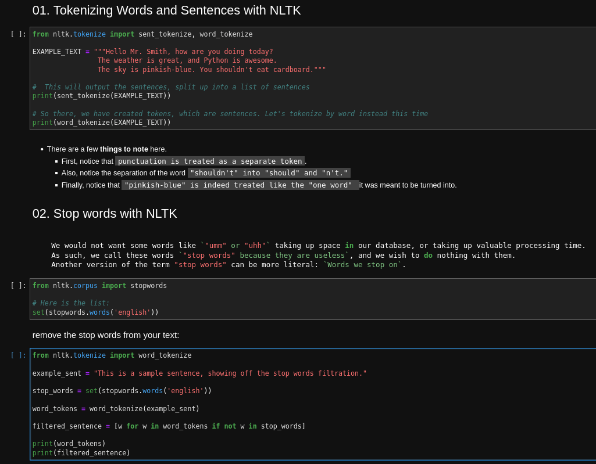
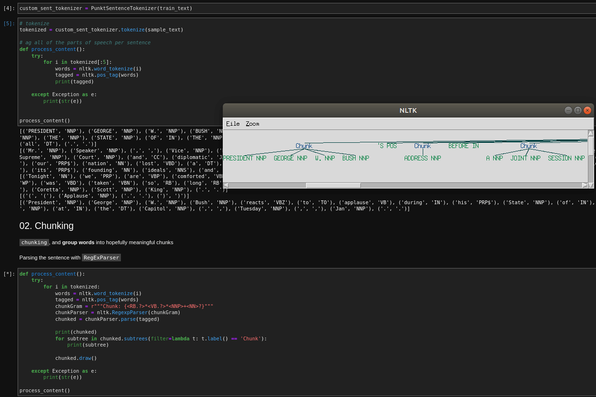

# 66daysofdata_NLP

Journey of 66DaysofData in Natural Language Processing

Please refer to [Ken Jee's #66DaysOfData Challenge](https://www.kennethjee.com/66daysofdata) for more info!

    
## Books

 - [Transformers for Natural Language Processing](https://www.packtpub.com/product/transformers-for-natural-language-processing/9781800565791)
 - [Practical Natural Language Processing](https://www.oreilly.com/library/view/practical-natural-language/9781492054047/)

## Sites

 - [pythonprogramming.net](https://pythonprogramming.net/tokenizing-words-sentences-nltk-tutorial/)
 
## Day 1 of #66DaysOfData

How we can scrap data from webpages using the Beautiful Soup.

  [Day 01 of #66DaysOfData](day01)
#### Lessons Learned

- reading a html page (Stack Overflow) and parsing and storing it in __Beautiful Soup__ format
- find the nevessary tags and class which it belongs to "question" and "andsers"
- extracting a question and its best-answer pair from a Stack Overflow web page
#### Screenshots

## Day 2 of #66DaysOfData

Getting started with `NLTK`.

  [Day 02 of #66DaysOfData](day02)
#### Lessons Learned

- **Tokenizing** Words and Sentences with NLTK
- Removing **Stop words** with NLTK
- **Stemming** words with NLTK
- **Lemmatization** words with NLTK

#### Screenshots

  
## Day 3 of #66DaysOfData

`NLTK`: part 2.

  [Day 03 of #66DaysOfData](day03)
#### Lessons Learned

- **Part of Speech Tagging** with NLTK
- **Chunking** and **Chinking** with NLTK

#### Screenshots

## Day 4 of #66DaysOfData

`NLTK`: part 3.

  [Day 04 of #66DaysOfData](day04)
#### Lessons Learned

- **Named Entity Recognition** with NLTK
- **Text Classification** 
- Converting **words to Features** 
- `Naive Bayes Classifier` with NLTK

#### Screenshots

## Day 5 of #66DaysOfData

`NLTK`: part 4.

  [Day 05 of #66DaysOfData](day05)
#### Lessons Learned

- Classifying movie_reviews with Scikit-Learn Sklearn and NLTK
- get model accuracy with **cross validation**

#### Screenshots

## Day 6 of #66DaysOfData

`NLTK`: part 5.

  [Day 06 of #66DaysOfData](day06)
#### Lessons Learned

- **Combining Algorithms (classifiers)** with NLTK
- Sklearn + NLTK VoteClassifier

#### Screenshots

## Day 7 of #66DaysOfData

`NLTK`: part 6.

  [Day 07 of #66DaysOfData](day07)
#### Lessons Learned

- saving and loading 'document' and 'word features'
- New movie review data was used and processed

#### Screenshots

## Day 8 of #66DaysOfData

`NLTK`: part 7.

  [Day 08 of #66DaysOfData](day08)
#### Lessons Learned

- NER with NLTK `Stanford NER tagger`.
- Testing NLTK and Stanford NER Taggers for Accuracy

#### Screenshots

[dataset](https://github.com/PinkyBlond/R-Machine-Learning/raw/master/News_Final.csv)
[word2vec-to-analyze-news-headlines](https://towardsdatascience.com/using-word2vec-to-analyze-news-headlines-and-predict-article-success-cdeda5f14751)

## Day 9 of #66DaysOfData

`word2vec`

  [Day 09 of #66DaysOfData](day09)
#### Lessons Learned

- word2vec with gensim
- kaggle data set

#### Screenshots

[Kaggle Data set: Car Features and MSRP](https://www.kaggle.com/CooperUnion/cardataset) 

## Days 10-11 of #66DaysOfData

`LSTM Classification model with Word2Vec`  

  [Days 10-11 of #66DaysOfData](day10-11)
#### Lessons Learned

- working with kaggle data set
- word2vec
- tensorflow LSTM model
- tensorflow embeding layer

#### Screenshots

## Days 12-13 of #66DaysOfData

`TF-IDF`  

  [Days 12-13 of #66DaysOfData](day12-13)
#### Lessons Learned

- Setting up TF-IDF with Scikit Learn
- clustering 22,000 descriptions into 5 categories
- k-means clustering

#### Screenshots

## Days 14 of #66DaysOfData

`Topic Modeling Task`  

  [Days 14 of #66DaysOfData](day14-19)
#### Lessons Learned

- [Kaggle steam-reviews-dataset](https://www.kaggle.com/luthfim/steam-reviews-dataset)
- Preparing the dictionary for typo correction purpose
- `Exploratory data analysis (EDA)`

#### Screenshots

## Days 15 of #66DaysOfData

`Topic Modeling Task`  

  [Days 15 of #66DaysOfData](day14-19)
#### Lessons Learned

- turn `tokenized` documents into a `id <-> term dictionary`
- TF-IDF topic modeling

#### Screenshots

